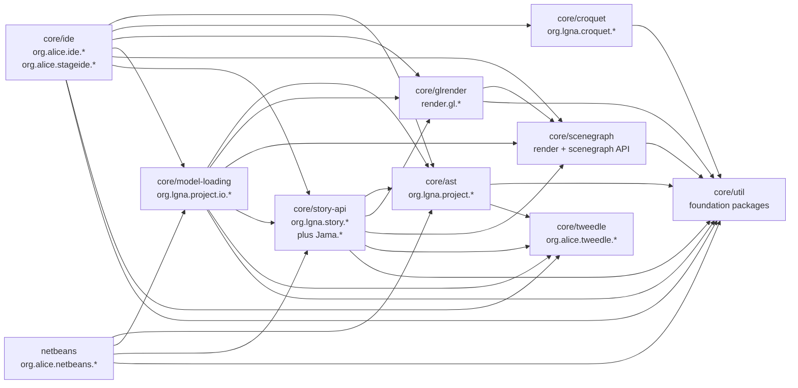
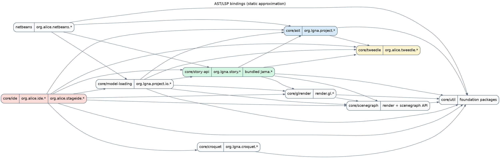

# AST + LSP Bindings

This layer is built from static package ownership plus Java import scanning across `core/*/src/main/java` and `netbeans/src/main/java`.
The approximation intentionally ignores JDK imports and avoids over-claiming where shared namespaces (especially `edu.cmu.cs.*`) span multiple modules.

## Static-approximation notes

- `core/util` is the lowest common package foundation for most other modules.
- `core/ide` is the heaviest cross-module consumer: it imports AST, Croquet, rendering, story API, Tweedle manifests, and model-loading entry points.
- `alice-ide/` is intentionally omitted from the main graph because the requested scan focused on `core/*` plus `netbeans`; it acts as a thin launcher over `core/ide`.

## Mermaid

Source: [`ast-lsp-bindings.mmd`](./ast-lsp-bindings.mmd)

## Graphviz DOT

Source: [`ast-lsp-bindings.dot`](./ast-lsp-bindings.dot)
